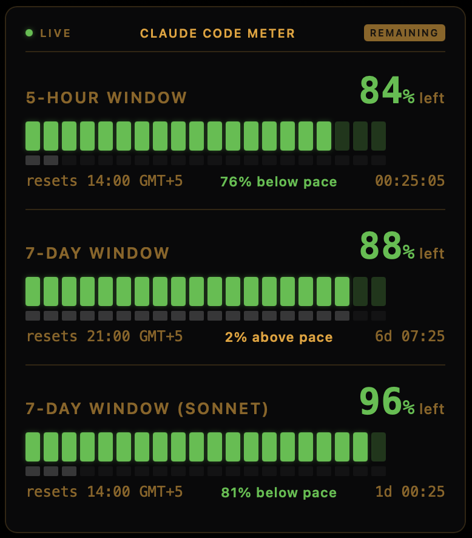
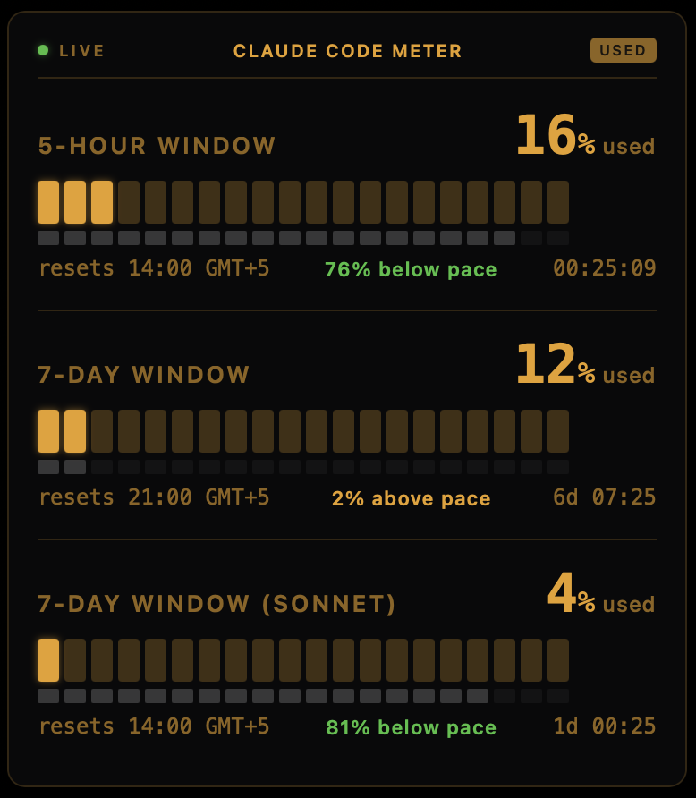

# Claude Code Meter

A macOS desktop widget that shows your Claude Code usage limits in real time. Built for [Ubersicht](https://tracesof.net/uebersicht/).

Displays the **5-hour rolling window**, **7-day rolling window**, and **7-day Sonnet-only window** with progress bars, pace indicators, exact reset time, and countdown timer.

## Screenshots

| Remaining mode | Used mode |
|:-:|:-:|
|  |  |

## Features

### Three usage windows

- **5-hour window** — short rolling window, resets frequently
- **7-day window** — weekly rolling window across all models
- **7-day window (Sonnet)** — weekly rolling window for Claude Sonnet only (hidden if no data)

### Pace tracking

Each window shows two bars stacked together:

- **Usage bar** (tall) — how much of your quota you've consumed or have remaining
- **Pace bar** (thin, below) — how far through the time window you currently are

Both bars move in the same direction and sync with the **used/remaining** mode toggle, so you can instantly see at a glance whether your token usage is ahead of or behind the time elapsed.

A **pace label** sits between the reset time and countdown for each window:

- 🟢 **X% below pace** — you're using tokens slower than time is passing (green)
- 🟡 **X% above pace** — you're slightly ahead of pace, up to 10% (amber)
- 🔴 **X% above pace** — you're well ahead of pace, over 10% (red)

### Display modes

Click the mode badge in the top-right corner to toggle between:

- **Remaining** — shows how much capacity is LEFT. Bars go green → amber → red as you approach empty.
- **Used** — shows how much capacity is CONSUMED. Bars go amber → red as you fill up.

The label next to each percentage (`left` / `used`) always clarifies what the number means.

## Requirements

- macOS 12+
- [Ubersicht](https://tracesof.net/uebersicht/) (free, open source)
- An active Claude Pro or Max subscription with Claude Code authenticated

## Installation

1. Install Ubersicht if you don't have it:

   ```bash
   brew install --cask ubersicht
   ```

2. Download `claude-code-meter.jsx` into your Ubersicht widgets folder:

   ```bash
   curl -o "$HOME/Library/Application Support/Übersicht/widgets/claude-code-meter.jsx" \
     https://raw.githubusercontent.com/pxlshpr/claude-code-meter/main/claude-code-meter.jsx
   ```

3. Launch Ubersicht (or it will pick up the file automatically if already running).

The widget reads your OAuth token from the macOS Keychain (stored there by Claude Code during `claude auth`). No manual token configuration needed.

## Settings

Open `claude-code-meter.jsx` in a text editor to change defaults at the top of the file:

| Setting | Default | Description |
|---------|---------|-------------|
| `DEFAULT_MODE` | `"remaining"` | Starting display mode (`"remaining"` or `"used"`) |
| `REFRESH_MS` | `30000` | API poll interval in milliseconds |

## Position

Change the `className` export to reposition the widget:

```js
export const className = {
  bottom: "20px",  // distance from bottom
  right: "20px",   // distance from right
  width: "380px",
};
```

## How it works

The widget pulls usage data from Anthropic's servers via their OAuth usage API (`https://api.anthropic.com/api/oauth/usage`). It does **not** track local sessions or count tokens client-side — it reads the same server-side utilization percentages that Anthropic calculates across all your Claude Code activity. The OAuth token stored in your macOS Keychain by `claude auth` is used to authenticate the request.

The API returns utilization percentages and reset timestamps for the 5-hour window, 7-day window, and Sonnet-specific 7-day window.

No data leaves your machine beyond the API call to Anthropic's servers (the same call Claude Code itself makes).

## Troubleshooting

| Problem | Solution |
|---------|----------|
| "Auth failed" error | Run `claude auth` in your terminal to refresh credentials |
| Widget not appearing | Grant Ubersicht screen recording permission in System Settings > Privacy & Security |
| "Loading..." stuck | Check that `security find-generic-password -s "Claude Code-credentials" -w` returns valid JSON |
| Stale countdown | The timer updates every 30s (on each API refresh), not every second |
| Sonnet window missing | Your plan may not include a Sonnet-specific limit; the row is hidden when no data is returned |

## License

MIT
