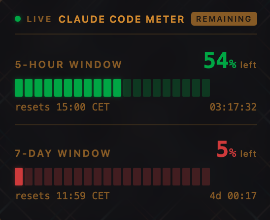

# Claude Code Meter

A macOS desktop widget that shows your Claude Code usage limits in real time. Built for [Ubersicht](https://tracesof.net/uebersicht/).

Displays both the **5-hour rolling window** and **7-day rolling window** with progress bars, percentage, exact reset time, and countdown timer.



## Requirements

- macOS 12+
- [Ubersicht](https://tracesof.net/uebersicht/) (free, open source)
- An active Claude Pro or Max subscription with Claude Code authenticated

## Installation

1. Install Ubersicht if you don't have it:

   ```bash
   brew install --cask ubersicht
   ```

2. Download `claude-code-meter.jsx` into your Ubersicht widgets folder:

   ```bash
   curl -o "$HOME/Library/Application Support/Übersicht/widgets/claude-code-meter.jsx" \
     https://raw.githubusercontent.com/gxjansen/claude-code-meter/main/claude-code-meter.jsx
   ```

3. Launch Ubersicht (or it will pick up the file automatically if already running).

The widget reads your OAuth token from the macOS Keychain (stored there by Claude Code during `claude auth`). No manual token configuration needed.

## Usage

### Display modes

The widget supports two display modes:

- **Remaining** -- shows how much capacity is LEFT (bucket draining). Bars go from green (plenty) to amber (getting low) to red (nearly empty).

  

- **Used** -- shows how much capacity is CONSUMED (counter filling). Bars go from amber (normal) to red (nearly full).

  

**Click the mode badge** in the top-right corner of the widget header to toggle between modes. The label next to each percentage (`left` / `used`) always clarifies what the number means.

### Settings

Open `claude-code-meter.jsx` in a text editor to change defaults at the top of the file:

| Setting | Default | Description |
|---------|---------|-------------|
| `DEFAULT_MODE` | `"remaining"` | Starting display mode (`"remaining"` or `"used"`) |
| `REFRESH_MS` | `30000` | API poll interval in milliseconds |

### Position

Change the `className` export to reposition the widget:

```js
export const className = {
  bottom: "20px",  // distance from bottom
  right: "20px",   // distance from right
  width: "280px",
};
```

## How it works

The widget queries the Anthropic OAuth usage API (`https://api.anthropic.com/api/oauth/usage`) using the OAuth token that Claude Code stores in your macOS Keychain. It returns utilization percentages and reset timestamps for both the 5-hour and 7-day rolling windows.

No data leaves your machine beyond the API call to Anthropic's servers (the same call Claude Code itself makes).

## Troubleshooting

| Problem | Solution |
|---------|----------|
| "Auth failed" error | Run `claude auth` in your terminal to refresh credentials |
| Widget not appearing | Grant Ubersicht screen recording permission in System Settings > Privacy & Security |
| "Loading..." stuck | Check that `security find-generic-password -s "Claude Code-credentials" -w` returns valid JSON |
| Stale countdown | The timer updates every 30s (on each API refresh), not every second |

## License

MIT
