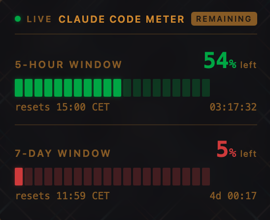
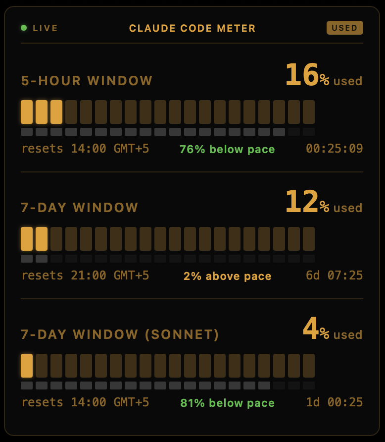

# Claude Code Meter

A macOS desktop widget that shows your Claude Code usage limits in real time. Built for [Ubersicht](https://tracesof.net/uebersicht/).

Displays both the **5-hour rolling window** and **7-day rolling window** with progress bars, percentage, exact reset time, and countdown timer.

## Requirements

- macOS 12+
- [Ubersicht](https://tracesof.net/uebersicht/) (free, open source)
- An active Claude Pro or Max subscription with Claude Code authenticated

## Installation

1. Install Ubersicht if you don't have it:

   ```bash
   brew install --cask ubersicht
   ```
   If you're installing Übersicht for the first time, run it once to create the `widgets` folder where this widget will be installed.

2. Download `claude-code-meter.jsx` into your Ubersicht widgets folder:

   ```bash
   curl -o "$HOME/Library/Application Support/Übersicht/widgets/claude-code-meter.jsx" \
     https://raw.githubusercontent.com/gxjansen/claude-code-meter/main/claude-code-meter.jsx
   ```

3. Launch Ubersicht (or it will pick up the file automatically if already running).

The widget reads your OAuth token from the macOS Keychain (stored there by Claude Code during `claude auth`). No manual token configuration needed.

## Usage

### Display modes

The widget supports two display modes:

- **Remaining** -- shows how much capacity is LEFT (bucket draining). Bars go from green (plenty) to amber (getting low) to red (nearly empty).

  

- **Used** -- shows how much capacity is CONSUMED (counter filling). Bars go from amber (normal) to red (nearly full).

  

**Click the mode badge** in the top-right corner of the widget header to toggle between modes. The label next to each percentage (`left` / `used`) always clarifies what the number means.

### Settings

Open `claude-code-meter.jsx` in a text editor to change defaults at the top of the file:

| Setting | Default | Description |
|---------|---------|-------------|
| `DEFAULT_MODE` | `"remaining"` | Starting display mode (`"remaining"` or `"used"`) |
| `REFRESH_MS` | `300000` | API poll interval in milliseconds (default 5 min) |

### Position

Change the `className` export to reposition the widget:

```js
export const className = {
  bottom: "20px",  // distance from bottom
  right: "20px",   // distance from right
  width: "280px",
};
```

## How it works

The widget pulls usage data from Anthropic's servers via their OAuth usage API (`https://api.anthropic.com/api/oauth/usage`). It does **not** track local sessions or count tokens client-side -- it reads the same server-side utilization percentages that Anthropic calculates across all your Claude Code activity. The OAuth token stored in your macOS Keychain by `claude auth` is used to authenticate the request.

The API returns utilization percentages and reset timestamps for both the 5-hour and 7-day rolling windows.

No data leaves your machine beyond the API call to Anthropic's servers (the same call Claude Code itself makes).

## Error handling

The widget detects specific error conditions and shows targeted messages:

- **Token expired** -- OAuth token has expired (typically after a reboot or long idle period). Click the re-authenticate button to launch `claude auth login`.
- **Authentication failed** -- API rejected the token (401/403). Click to re-authenticate.
- **No credentials found** -- Claude Code keychain entry is missing. Run `claude auth login` in your terminal.
- **Rate limited** -- Too many API requests. The widget shows cached data (with an amber "cached" indicator) during backoff, then retries automatically.
- **Network error** -- Cannot reach the Anthropic API. Check your internet connection.

For auth-related errors, the widget shows a clickable **re-authenticate button** that runs `claude auth login` to open a browser-based login flow. Once you complete the login, the widget will automatically pick up the new token on its next refresh.

## Troubleshooting

| Problem | Solution |
|---------|----------|
| "Token expired" or "Authentication failed" | Click the re-authenticate button in the widget, or run `claude auth login` in your terminal |
| Widget not appearing | Grant Ubersicht screen recording permission in System Settings > Privacy & Security |
| "Loading..." stuck | Check that `security find-generic-password -s "Claude Code-credentials" -w` returns valid JSON |
| Stale countdown | The timer updates every 5 minutes (on each API refresh), not every second |

## License

MIT
